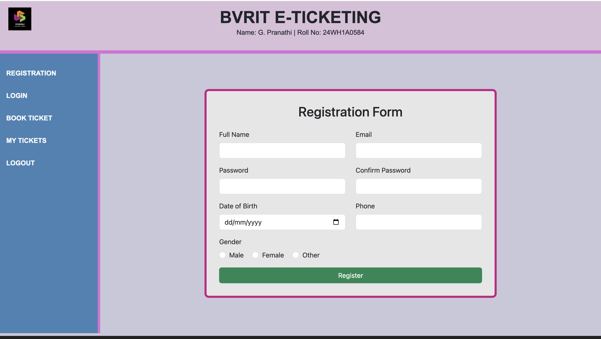
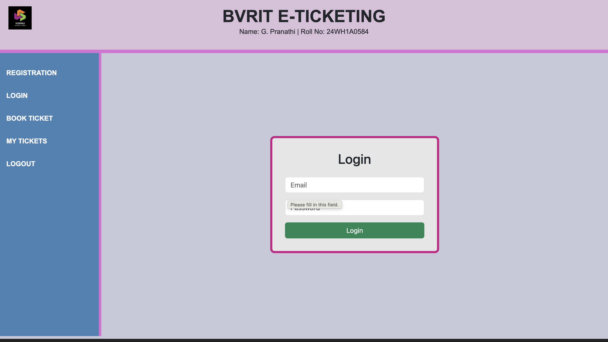
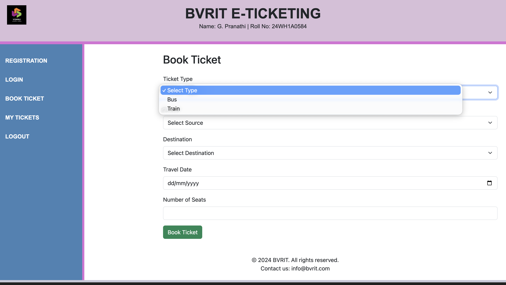
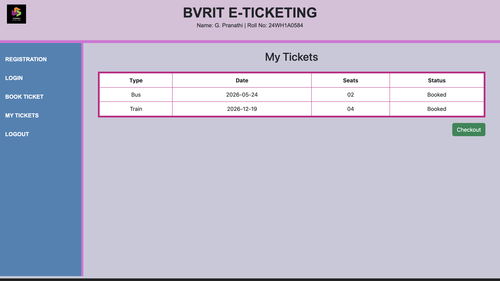
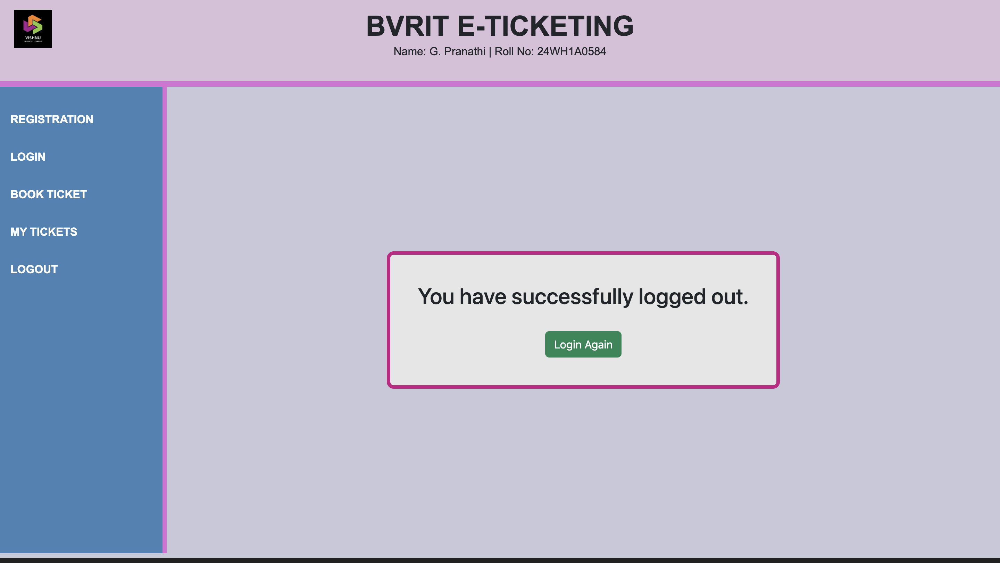

# 🎟️ BVRIT E-Ticketing Application

This is a responsive **E-Ticketing Web Application** developed using **HTML5, CSS3, Bootstrap 5, and JavaScript**.  
It includes Registration, Login, Ticket Booking, My Tickets, and Logout pages.

---

## 📌 Features
- User Registration Page
- User Login Page
- Ticket Booking Page
- My Tickets Page (stored using LocalStorage)
- Logout Page
- Responsive Layout using Bootstrap Grid and Flex

---

## 🛠️ Technologies Used
- HTML5
- CSS3
- Bootstrap 5
- JavaScript (LocalStorage)

---

# 📷 Output Screenshots

## 📝 Registration Page

---

## 🔑 Login Page

---

## 🎫 Ticket Booking Page

---

## 📄 My Tickets Page

---

## 🚪 Logout Page

---

## 👩‍💻 Developed By
**Name:** G. Pranathi  
**Roll No:** 24WH1A0584   

---
